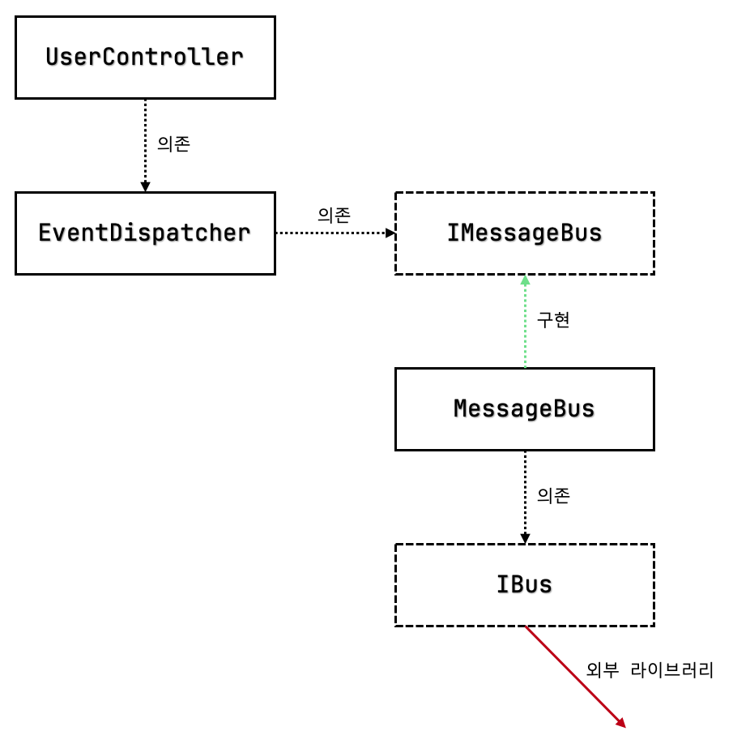

# 목 처리에 대한 모범 사례

### 들어가며
- 목은 비관리 의존성(외부에서 식별할 수 있는 의존성)에만 적용해야 한다.
  - 다른 곳에 목을 적용하면 깨지기 쉬운 테스트가 된다.
  - 그 이유는 다음과 같다.
    - 관리 의존성(테스트 대상 내부에 포함된 의존성)을 테스트할 경우 내부 구현에 강결합되기 쉽다.
    - 내부 구현에 강결합되면, 내부 구현의 변경으로 거짓양성을 보이기 쉽다.
    - 내부 구현을 모킹하면, 테스트가 애플리케이션의 실제 동작을 반영하지 못할 수 있다.

# 9.1 목의 가치를 극대화하기
- 아래는 앞으로 살펴볼 이메일 변경 코드이다.
- 기본적으로 비관리 의존성만을 목으로 대체하여 테스트할 것이다.
- 비관리 의존성을 목으로 대체하는 것 말고, 더 나은 테스트를 위해 무엇을 할 수 있을까?

**UserController**
```C#
public class UserController {
    private readonly Database _database;
    private readonly EventDispatcher _eventDispatcher;

    public UserController(Database database, IMessageBus messageBus, IDomainLogger domainLogger) { // 비관리 의존성
        _database = database;
        _eventDispatcher = new EventDispatcher(messageBus, domainLogger);
    }

    public string ChangeEmail(int userId, string newEmail) {
        object[] userData = _database.GetUserById(userId);
        User user = UserFactory.Create(userData);
        string error = user.CanChangeEmail();
        if (error != null) return error;
        object[] companyData = _database.GetCompany();
        Company company = CompanyFactory.Create(companyData);
        user.ChangeEmail(newEmail, company);
        _database.SaveCompany(company);
        _database.SaveUser(user);

        _eventDispatcher.Dispatch(user.DomainEvents); // 비관리 의존성 호출
        return "OK";
    }
}
```

**EventDispatcher**
```C#
public class EventDispatcher {
    private readonly IMessageBus _messageBus;
    private readonly IDomainLogger _domainLogger;
    
    public EventDispatcher(IMessageBus messageBus, IDomainLogger domainLogger) {
        _domainLogger = domainLogger;
        _messageBus = messageBus;
    }

    public void Dispatch(List<IDomainEvent> events) {
        foreach (IDomainEvent ev in events) {
            Dispatch(ev);
        }
    }

    private void Dispatch(IDomainEvent ev) {
        switch (ev) {
            case EmailChangedEvent emailChangedEvent:
                _messageBus.SendEmailChangedMessage(emailChangedEvent.UserId, emailChangedEvent.NewEmail);
                break;
            case UserTypeChangedEvent userTypeChangedEvent:
                _domainLogger.UserTypeHasChanged(userTypeChangedEvent.UserId, userTypeChangedEvent.OldType, userTypeChangedEvent.NewType);
                break;
        }
    }
}
```

**통합테스트 - IMessageBus를 목으로 처리하기**
```C#
[Fact]
public void Changing_email_from_corporate_to_non_corporate() {
    // Arrange
    var db = new Database(ConnectionString);
    User user = CreateUser("user@mycorp.com", UserType.Employee, db);
    CreateCompany("mycorp.com", 1, db);

    var messageBusMock = new Mock<IMessageBus>(); // 비관리 의존성을 목으로 대체
    var loggerMock = new Mock<IDomainLogger>(); // 비관리 의존성을 목으로 대체

    var sut = new UserController(db, messageBusMock.Object, loggerMock.Object);
    
    // Act
    string result = sut.ChangeEmail(user.UserId, "new@gmail.com");

    // Assert
    Assert.Equal("OK", result);
    object[] userData = db.GetUserById(user.UserId);
    User userFromDb = UserFactory.Create(userData);
    Assert.Equal("new@gmail.com", userFromDb.Email);
    Assert.Equal(UserType.Customer, userFromDb.Type);
    object[] companyData = db.GetCompany();
    Company companyFromDb = CompanyFactory.Create(companyData);
    Assert.Equal(0, companyFromDb.NumberOfEmployees);
    
    messageBusMock.Verify(
        x => x.SendEmailChangedMessage(user.UserId, "new@gmail.com"), // 목 상호작용 검증
        Times.Once);
    loggerMock.Verify(
        x => x.UserTypeHasChanged(user.UserId, UserType.Employee, UserType.Customer), // 목 상호작용 검증
        Times.Once);
}
```

## 목 가치 극대화 1 - 시스템 끝에서 상호 작용 검증하기
- 더 정확히 말하면 **비관리 의존성과의 상호작용은 시스템 끝에서 검증하기.** 가 된다.
- 현재 IMessageBus 측 구현은 다음과 같이 생겼다.

**IMessageBus, MessageBus, IBus**
```C#
public interface IMessageBus {
    void SendEmailChangedMessage(int userId, string newEmail);
}

public class MessageBus : IMessageBus {
    private readonly IBus _bus;
    
    public void SendEmailChangedMessage(int userId, string newEmail) {
        _bus.Send("Type: USER EMAIL CHANGED; " +
                $"Id: {userId}; " +
                $"NewEmail: {newEmail}");
    }
}

public interface IBus {
    void Send(string message);
}
```

- IMessageBus, MessageBus, IBus 모두 프로젝트 코드베이스이다.
- IBus는 연결 자격 증명과 같이 필요하지 않은 세부 사항을 캡슐화하는 인터페이스이다.
- IMessageBus는 도메인과 관련된 메시지를 정의한다.



- 육각형 아키텍쳐 관점에서 볼 때, IBus는 UserController와 메시지 버스 사이의 마지막 고리이다.
- IMessageBus를 목으로 처리하지 않고, IBus를 목으로 처리하면 회귀방지를 극대화할 수 있다.
  - 하나의 통합테스트가 거치는 클래스의 수가 증가하므로, 회귀방지가 향상되는 것이다!
- IMessageBus가 아니라 IBus를 목으로 처리할 경우 테스트는 다음과 같이 작성된다.

**통합테스트 - IBus를 목으로 처리하기**
```C#
[Fact]
public void Changing_email_from_corporate_to_non_corporate() {
    var busMock = new Mock<IBus>(); // 이제 IBus를 모킹한다.
    var messageBus = new MessageBus(busMock.Object); // MessageBus는 실제 객체를 사용한다.
    var loggerMock = new Mock<IDomainLogger>();
    var sut = new UserController(db, messageBus, loggerMock.Object);
    
    /* ... */

    busMock.Verify(
        x => x.Send("Type: USER EMAIL CHANGED; " +
                    $"Id: {user.UserId}; " +
                    "NewEmail: new@gmail.com"),
        Times.Once);
}
```

- 이렇게 IBus(시스템의 끝)을 테스트하여 얻는 장점이 하나 더 있다.
- 리팩터링 내성 역시 좋아진다.
  - 외부 시스템은 애플리케이션으로부터 **텍스트 메시지**를 받는다.
  - 이는 외부에서 식별할 수 있는 유일한 사이드 이펙트이며, 이를 테스트하는 것이 바람직하다.
  - 구현세부사항이 아니라 식별할 수 있는 사이드 이펙트를 테스트해야 리팩터링에 강한 테스트가 된다.
- 마지막으로 과거의 검증절과 현재의 검증절을 비교해보자.
```C#
// 과거의 검증절
messageBusMock.Verify(
        x => x.SendEmailChangedMessage(user.UserId, "new@gmail.com"),
        Times.Once);

// 현재의 검증절
busMock.Verify(
        x => x.Send("Type: USER EMAIL CHANGED; " +
                    $"Id: {user.UserId}; " +
                    "NewEmail: new@gmail.com"),
        Times.Once);

/*
외부에서는 SendEmailChangedMessage()가 호출되었는지 관심없다.
그저 적절한 텍스트 값만 받으면 된다.
따라서 현재의 검증절이 더 우수하다고 볼 수 있다.
*/
```

### 잠깐만, IDomainLogger는 어떻게 처리하지?
- IDomainLogger도 상황은 비슷하다.
  - IDomainLogger -> DomainLogger <- ILogger ... 외부 라이브러리
- 그렇다면 ILogger를 목으로 처리하는게 더 좋은 방법이지 않을까?
- 책에서는 그대로 IDomainLogger를 목으로 처리해도 괜찮다고 한다.
- 이유는 다음과 같다.
  - 메시지 버스와는 다르게, 텍스트 로그의 정확한 구조는 클라이언트에게 큰 상관이 없다.
  - 텍스트 로그의 경우 더 중요한 것은 **로그가 있다는 것과 로그에 있는 정보** 뿐이다.
  - 따라서 그대로 두어도 충분히 테스트된다.

## 목 가치 극대화 2 - 목을 스파이로 대체하기

- 스파이는 목과 같은 역할을 한다.
- 유일한 차이는 목은 목 프레임워크의 도움을 받아 생성되고, 스파이는 수동으로 작성된다는 것이다.
- 시스템 끝에 있는 클래스의 경우 목보다 스파이가 더 낫다.
  - 플루언트 인터페이스(말하는 것처럼 작성되는 코드) 덕분에 상호작용을 검증하는 것이 간결해지고 표현력이 좋아지기 때문이다!

**IBus를 상속받는 스파이 객체**
```C#
public class BusSpy : IBus {
    private List<string> _sentMessages = new List<string>();
    
    public void Send(string message) {
        _sentMessages.Add(message);
    }

    // 플루언트 인터페이스
    public BusSpy ShouldSendNumberOfMessages(int number) {
        Assert.Equal(number, _sentMessages.Count);
        return this;
    }

    // 플루언트 인터페이스
    public BusSpy WithEmailChangedMessage(int userId, string newEmail) {
        string message = "Type: USER EMAIL CHANGED; " +
                    $"Id: {userId}; " +
                    $"NewEmail: {newEmail}";
        Assert.Contains(_sentMessages, x => x == message);
        return this;
    }
}
```

**통합테스트 - IBus를 목에서 스파이로 바꾸기**
```C#
[Fact]
public void Changing_email_from_corporate_to_non_corporate() {
    var busSpy = new BusSpy();
    var messageBus = new MessageBus(busSpy);
    var loggerMock = new Mock<IDomainLogger>();
    var sut = new UserController(db, messageBus, loggerMock.Object);
    
    /* ... */

    // 플루언트 인터페이스 사용
    busSpy.ShouldSendNumberOfMessages(1)
    .WithEmailChangedMessage(user.UserId, "new@gmail.com");
}
```

# 9.2 목처리에 대한 모범 사례
- 현재까지 살펴본 내용은 다음과 같다.
  - 비관리 의존성에만 목 적용하기
  - 시스템 끝에 있는 의존성에 대해 상호 작용 검증하기
  - 시스템 끝에 있는 의존성에 목을 적용할 때에는 스파이를 되도록 사용하기
- 이번에는 나머지 모범 사례를 설명한다.
  - 단위테스트가 아닌 통합테스트에서만 목 사용하기
  - 항상 목 호출 수 확인하기
  - 보유 타입만 목으로 처리하기

## 모범 사례 1 - 통합테스트에서만 목 사용하기
- 이 사례는 사실 목적보다는 결과에 가까운 사례이다.
- 프로젝트 코드베이스의 비즈니스 로직과 오케스트레이션은 분리되어야 한다.
- 이렇게 분리되면 모든 코드는 둘 중 하나에만 속하게 된다.
  - 복잡한 코드 (도메인)
  - 외부 의존성과 통신하는 코드 (컨트롤러)
- 도메인은 단위테스트를 진행하게 되며, 컨트롤러는 통합테스트를 진행하게 된다.
- 즉, 외부 의존성과 통신하지 않는 도메인 코드를 테스트할 때는 단위테스트를 진행하게 되며, 단위테스트에서는 목을 사용할 필요가 없어진다.

### 한 테스트에 목은 하나만 사용해야 할까?
- 그럴 필요 없다.
- 테스트가 나뉘는 기준은 **코드 단위**가 아니라, **동작 단위**이다.
- 따라서 목의 개수는 참여하는 비관리 의존성의 개수에 의해 결정될 뿐이다.

## 모범 사례 2 - 호출 수 검증하기
- 호출 수 검증은 아래 두가지 내용을 뜻한다.
  - **예상하는 호출이 있는가?**
  - **예상하지 않는 호출이 없는가?**
- 이는 비관리 의존성과 하위 호환성을 지켜야 하기 때문이다.
  - 애플리케이션은 외부 시스템이 예상하는 메시지를 생략하면 안된다.
  - 애플리케이션은 외부 시스템이 예상하지 않는 메시지를 생성해서는 안된다.

## 모범 사례 3 - 보유 타입만 목으로 처리하기
- 서드파티 라이브러리를 바로 사용하는 것이 아니라, 서드파티 라이브러리에 맞는 어댑터를 작성하고, 해당 어댑터를 목으로 처리하라는 뜻이다.
- 이렇게 처리하는 데에는 다음과 같은 이유가 있다.
  - 라이브러리의 복잡성을 추상화할 수 있다.
  - 라이브러리에서 필요한 기능만을 노출할 수 있다.
  - 프로젝트 도메인을 사용해 수행할 수 있다.
  - 라이브러리의 변경 사항이 생겼을 때, 파급효과를 어댑터만으로 제한할 수 있다.